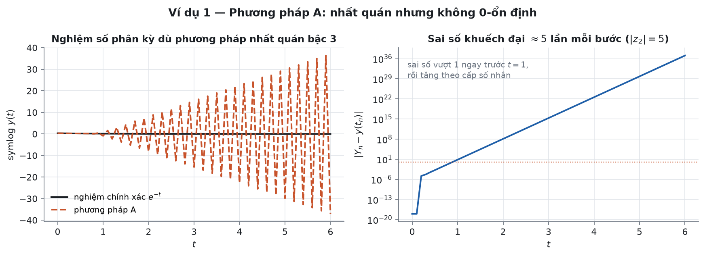
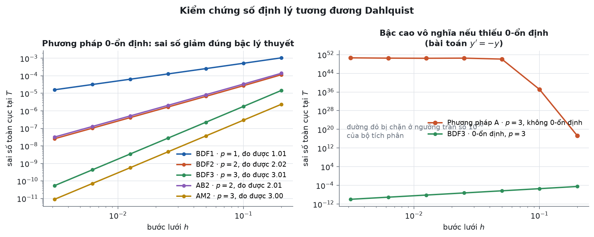
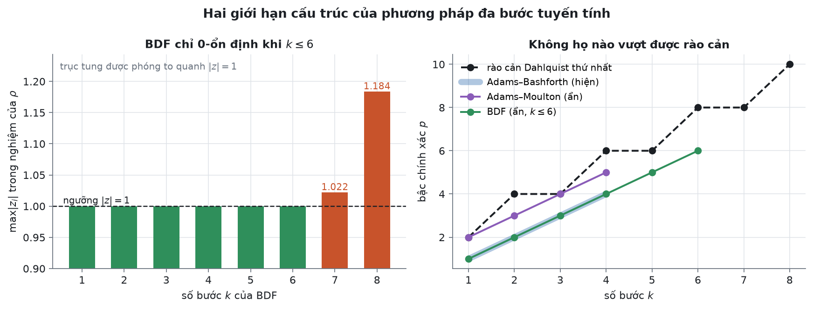
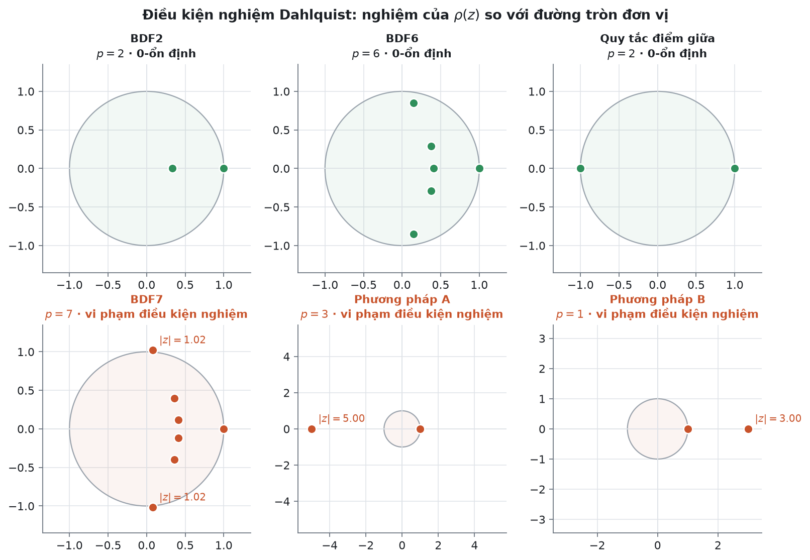
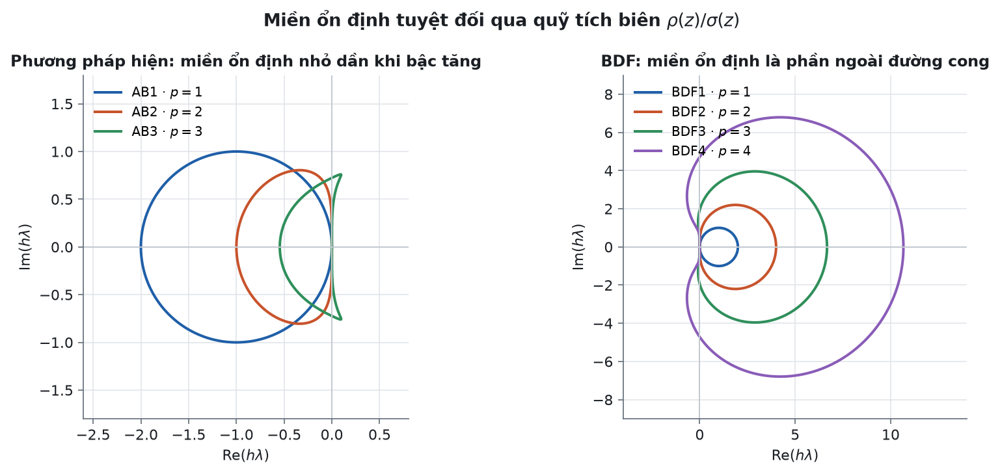

# Ổn định, nhất quán và hội tụ của phương pháp đa bước tuyến tính

[](https://github.com/tu-h-nguyn/Stability-Consistency-and-Convergence-of-Linear-Multistep-Methods/actions/workflows/ci.yml)
[](https://www.python.org/)
[](code/tests)
[](LICENSE)

> **Định lý tương đương Dahlquist (1956).** Một phương pháp đa bước tuyến tính hội tụ
> **khi và chỉ khi** nó vừa nhất quán, vừa 0-ổn định.

Dự án gồm hai nửa gắn chặt với nhau: một **báo cáo LaTeX** trình bày lý thuyết đầy đủ
(sai số cắt cụt, toán tử sai phân tuyến tính, điều kiện nghiệm, chứng minh định lý
tương đương Dahlquist, họ BDF), và một **thư viện Python `lmm`** biến toàn bộ lý thuyết
đó thành mã chạy được — mọi con số và hình vẽ trong báo cáo đều tái lập được bằng một
câu lệnh.

Điểm mấu chốt: thư viện **không hard-code** kết luận nào. Đưa vào bộ hệ số
$(\alpha_j, \beta_j)$, nó tự suy ra bậc chính xác, hằng số sai số, nghiệm của đa thức
đặc trưng, tính 0-ổn định và miền ổn định tuyệt đối. Nhờ vậy, những khẳng định như
*"BDF chỉ 0-ổn định khi $k \le 6$"* hay *"rào cản Dahlquist thứ nhất"* được **kiểm
chứng bằng số** trong bộ test, chứ không phải chép lại từ sách.

<p align="center">
  
</p>

*Phương pháp A nhất quán bậc 3 — bậc cao hơn cả BDF2 — nhưng đa thức $\rho$ có nghiệm
$z = -5$. Sai số bị nhân 5 lần sau mỗi bước và đạt $10^{37}$ tại $t = 6$. Bậc chính xác
không cứu nổi một phương pháp không 0-ổn định.*

---

## Mục lục

- [Kết quả chính](#kết-quả-chính)
- [Chạy thử trong 30 giây](#chạy-thử-trong-30-giây)
- [Thư viện `lmm`](#thư-viện-lmm)
- [Các thí nghiệm số](#các-thí-nghiệm-số)
- [Kiểm chứng bằng test](#kiểm-chứng-bằng-test)
- [Cấu trúc dự án](#cấu-trúc-dự-án)
- [Biên dịch báo cáo](#biên-dịch-báo-cáo)
- [Tài liệu tham khảo](#tài-liệu-tham-khảo)
- [English summary](#english-summary)

---

## Kết quả chính

Bảng dưới do `code/experiments/run_all.py` sinh ra, không nhập tay
(bản đầy đủ: [`figures/RESULTS.md`](figures/RESULTS.md)):

| phương pháp | k | loại | bậc p | $C_{p+1}$ | nhất quán | 0-ổn định | hội tụ |
|---|---:|---|---:|---:|:---:|:---:|:---:|
| Euler hiện | 1 | hiện | 1 | +0.5 | ✅ | ✅ | ✅ |
| Quy tắc hình thang | 1 | ẩn | 2 | −0.0833 | ✅ | ✅ | ✅ |
| Công thức Simpson | 2 | ẩn | 4 | −0.0111 | ✅ | ✅ | ✅ |
| AB3 | 3 | hiện | 3 | +0.375 | ✅ | ✅ | ✅ |
| AM3 | 3 | ẩn | 4 | −0.0264 | ✅ | ✅ | ✅ |
| BDF6 | 6 | ẩn | 6 | −0.1429 | ✅ | ✅ | ✅ |
| **Phương pháp A** | 2 | hiện | **3** | +0.1667 | ✅ | ❌ | ❌ |
| **Phương pháp B** | 2 | ẩn | 1 | +4 | ✅ | ❌ | ❌ |

Bốn kết luận rút ra được từ mã nguồn:

1. **Nhất quán là chưa đủ.** Phương pháp A đạt bậc 3 mà vẫn phân kỳ; phương pháp B là
   phương pháp *ẩn* và cũng phân kỳ. Tính ẩn hay bậc cao đều không thay thế được
   0-ổn định.
2. **Bậc đo được khớp bậc lý thuyết**: sai lệch lớn nhất 0.12 trên 8 phương pháp
   0-ổn định (BDF1–4, AB2–3, AM2–3) — kiểm chứng chiều thuận của định lý Dahlquist.
3. **BDF mất 0-ổn định từ $k = 7$**: $\max|z_i| = 1.0222 > 1$. Ranh giới $k \le 6$ hiện
   ra từ chính nghiệm đa thức, không cần giả định trước.
4. **Rào cản Dahlquist thứ nhất** ($p \le k+2$ với $k$ chẵn, $p \le k+1$ với $k$ lẻ)
   không bị họ nào trong danh mục vượt qua; Simpson chạm đúng chặn trên với $k=2, p=4$.

<p align="center">
  
</p>

<p align="center">
  
</p>

---

## Chạy thử trong 30 giây

```bash
git clone https://github.com/tu-h-nguyn/Stability-Consistency-and-Convergence-of-Linear-Multistep-Methods.git
cd Stability-Consistency-and-Convergence-of-Linear-Multistep-Methods
pip install -r requirements.txt

# Phân tích một phương pháp bất kỳ trong danh mục
cd code && python -m lmm bdf3 method-a
```

```text
BDF3  (implicit, k = 3)
  rho(z) = 1.83333z^3 - 3z^2 + 1.5z - 0.333333
  sigma(z) = z^3
  rho(1) = -5.55e-17,  rho'(1) = +1,  sigma(1) = +1
  consistent: True   order p = 3   error constant C_{p+1} = -0.25
  root condition: SATISFIED
    z = +1.000000 +0.000000i   |z| = 1.000000
    z = +0.318182 +0.283864i   |z| = 0.426401
    z = +0.318182 -0.283864i   |z| = 0.426401
  Dahlquist verdict: CONVERGENT

Phương pháp A  (explicit, k = 2)
  ...
  root condition: VIOLATED
    z = -5.000000 +0.000000i   |z| = 5.000000  <- |z| > 1
  Dahlquist verdict: NOT convergent
```

Vài lệnh khác:

```bash
python -m lmm --list                          # bảng tổng hợp toàn bộ danh mục
python -m lmm bdf2 --solve stiff --h 0.05     # giải một bài toán mẫu
python -m lmm ab3 --convergence               # đo bậc hội tụ thực nghiệm
```

Hoặc dùng `make` từ thư mục gốc:

```bash
make figures   # sinh lại toàn bộ hình vẽ + figures/RESULTS.md
make test      # chạy 68 test
make report    # biên dịch main.pdf (cần LaTeX)
```

---

## Thư viện `lmm`

Một phương pháp đa bước tuyến tính $k$ bước được viết thống nhất dưới dạng

$$\sum_{j=0}^{k} \alpha_j Y_{n+j} = h \sum_{j=0}^{k} \beta_j f_{n+j}, \qquad f_{n+j} = f(t_{n+j}, Y_{n+j}).$$

```python
from lmm import LinearMultistepMethod, bdf
from lmm.problems import LOGISTIC

# Phương pháp A của Chương 4, khai báo trực tiếp từ hệ số
method_a = LinearMultistepMethod(alpha=(-5, 4, 1), beta=(2, 4, 0), name="Phương pháp A")

method_a.order              # 3      -- từ toán tử sai phân tuyến tính
method_a.error_constant     # 1/6
method_a.is_consistent      # True
method_a.is_zero_stable     # False  -- nghiệm z = -5 nằm ngoài đĩa đơn vị
method_a.is_convergent      # False  -- định lý Dahlquist
print(method_a.root_condition())

# Tích phân một bài toán giá trị đầu
sol = bdf(2).solve(LOGISTIC.f, LOGISTIC.t_span, h=0.05, startup=LOGISTIC.exact)
sol.error_against(LOGISTIC.exact)[-1]      # 6.7e-06
```

Những gì thư viện tự suy ra từ $(\alpha, \beta)$:

| Đại lượng | Cách tính | API |
|---|---|---|
| Bậc chính xác $p$ | $C_q = \frac{1}{q!}\sum j^q \alpha_j - \frac{1}{(q-1)!}\sum j^{q-1}\beta_j$ | `.order` |
| Hằng số sai số $C_{p+1}$ | hệ số đầu tiên khác 0 | `.error_constant` |
| Nhất quán | $\rho(1)=0$ và $\rho'(1)=\sigma(1)$ | `.is_consistent` |
| Điều kiện nghiệm | nghiệm của $\rho$, kể cả nghiệm bội trên $\|z\|=1$ | `.root_condition()` |
| 0-ổn định | điều kiện nghiệm được thoả | `.is_zero_stable` |
| Hội tụ | nhất quán **và** 0-ổn định | `.is_convergent` |
| Miền ổn định tuyệt đối | quỹ tích biên $z \mapsto \rho(z)/\sigma(z)$ | `.boundary_locus()` |

**Bộ tích phân** xử lý cả phương pháp hiện lẫn ẩn (Newton với Jacobian sai phân hữu
hạn), cả bài toán vô hướng lẫn hệ, khởi động bằng nghiệm chính xác hoặc bằng RK4, và
báo cờ `diverged` thay vì trả về `NaN` khi nghiệm số nổ.

Hệ số của **BDF** và **Adams** được *sinh ra* chứ không chép tay: BDF từ khai triển
sai phân lùi $\sum_{j\ge 1} \frac{1}{j}\nabla^j Y_{n+k} = h f_{n+k}$, Adams từ tích
phân chính xác đa thức nội suy Lagrange. Test đối chiếu chúng với bảng chuẩn trong
Hairer–Nørsett–Wanner, nên `bdf(9)` cũng lấy được hệ số đúng (và bị phát hiện là không
0-ổn định).

---

## Các thí nghiệm số

Mỗi script tự chạy độc lập và in ra bảng số kèm hình vẽ.

| Script | Nội dung | Hình |
|---|---|---|
| `ex01_method_a.py` | Ví dụ 1: nhất quán bậc 3, phân kỳ vì $z=-5$ | `fig01_method_a.png` |
| `ex02_method_b.py` | Ví dụ 2: phương pháp ẩn vẫn phân kỳ vì $z=3$ | `fig02_method_b.png` |
| `ex03_root_condition.py` | Nghiệm của $\rho$ so với đường tròn đơn vị | `fig03_root_condition.png` |
| `ex04_convergence.py` | Bậc hội tụ đo được so với lý thuyết | `fig04_convergence.png` |
| `ex05_stability_regions.py` | Miền ổn định tuyệt đối, vì sao BDF hợp bài toán cứng | `fig05_stability_regions.png` |
| `ex06_dahlquist_barrier.py` | Rào cản Dahlquist và giới hạn $k \le 6$ | `fig06_dahlquist_barrier.png` |

Bảng số của `ex01`/`ex02` **trùng khớp từng chữ số** với bảng MATLAB trong báo cáo —
hai cài đặt độc lập cho cùng một kết quả:

| $t$ | nghiệm chính xác | phương pháp A | sai số |
|---:|---:|---:|---:|
| 0.5 | 6.065307e-01 | 6.081996e-01 | 1.669e-03 |
| 1.0 | 3.678794e-01 | −6.677259e+00 | 7.045e+00 |
| 4.0 | 1.831564e-02 | −3.872979e+22 | 3.873e+22 |
| 6.0 | 2.478752e-03 | −1.206376e+37 | 1.206e+37 |

<p align="center">
  
</p>

<p align="center">
  
</p>

---

## Kiểm chứng bằng test

```bash
cd code && python -m pytest tests -q
# 68 passed
```

Test không chỉ kiểm tra code chạy được, mà kiểm chứng **các phát biểu toán học**:

- hệ số BDF1–6, AB1–4, AM1–3 khớp bảng chuẩn; `bdf(1)` đúng bằng Euler ẩn, `adams_moulton(1)` đúng bằng quy tắc hình thang;
- bậc hội tụ **đo được** khớp bậc lý thuyết (sai lệch < 0.25) cho 8 phương pháp;
- phương pháp A và B nổ với **mọi** bước lưới — giảm $h$ không cứu được;
- BDF 0-ổn định với $k \le 6$, mất 0-ổn định với $k = 7, 8$;
- nghiệm bội trên đường tròn đơn vị ($\rho(z)=(z-1)^2$) bị bắt lỗi đúng;
- rào cản Dahlquist thứ nhất và thứ hai (BDF3 không A-ổn định);
- BDF2 vượt qua bài toán cứng ở bước lưới mà AB2 nổ tung;
- quy tắc hình thang giữ nguyên biên độ dao động điều hoà sau 200 đơn vị thời gian.

---

## Cấu trúc dự án

```
.
├── main.tex                  # báo cáo LaTeX (tiếng Việt)
├── Sections/                 # 4 chương (section_1..4) + một bản nháp chưa dùng
├── images/                   # hình gốc trong báo cáo
├── slides/                   # bản trình bày Beamer
│
├── code/
│   ├── lmm/                  # thư viện
│   │   ├── core.py           # LinearMultistepMethod: bậc, điều kiện nghiệm, bộ tích phân
│   │   ├── catalog.py        # BDF / Adams sinh tự động + các phương pháp kinh điển
│   │   ├── problems.py       # bài toán mẫu kèm nghiệm chính xác
│   │   ├── analysis.py       # nghiên cứu hội tụ, bảng tổng hợp
│   │   ├── plotting.py       # phong cách đồ hoạ dùng chung
│   │   └── __main__.py       # giao diện dòng lệnh
│   ├── experiments/          # 6 thí nghiệm + run_all.py
│   └── tests/                # 68 test
│
├── matlab/                   # mã MATLAB gốc trích từ báo cáo, chạy được độc lập
├── figures/                  # hình sinh tự động + RESULTS.md
├── Makefile
└── .github/workflows/ci.yml  # test + kiểm tra hình không lỗi thời + build PDF
```

CI chạy toàn bộ test, sinh lại tất cả hình vẽ rồi so sánh với bản đã commit (cảnh báo
nếu lệch), và biên dịch cả `main.pdf` lẫn `slides/main.pdf` trong container TeX Live.

---

## Biên dịch báo cáo

```bash
make report    # -> main.pdf
make slides    # -> slides/main.pdf
```

Cần một bản phân phối TeX có `babel-vietnamese`, `tcolorbox`, `listings`, `titlesec`
(TeX Live đầy đủ là đủ). Trên Overleaf: upload cả thư mục, đặt `main.tex` làm tài liệu
chính, biên dịch bằng pdfLaTeX.

---

## Tài liệu tham khảo

1. K. Atkinson, W. Han, D. Stewart, *Numerical Solution of Ordinary Differential Equations*, Wiley, 2009.
2. E. Hairer, S. P. Nørsett, G. Wanner, *Solving Ordinary Differential Equations I: Nonstiff Problems*, 2nd ed., Springer, 1993.
3. E. Süli, *Numerical Solution of Ordinary Differential Equations*, Lecture Notes, University of Oxford, 2022.
4. G. Dahlquist, *Convergence and stability in the numerical integration of ordinary differential equations*, Math. Scand. 4 (1956), 33–53.

Báo cáo thực hiện trong môn **Giải tích số cho Phương trình vi phân**, Trường Đại học
Khoa học Tự nhiên, ĐHQG-HCM, dưới hướng dẫn của TS. Nguyễn Đăng Khoa.

Mã nguồn phát hành theo giấy phép [MIT](LICENSE).

---

## English summary

**Stability, consistency and convergence of linear multistep methods.**

A Vietnamese-language report on the Dahlquist equivalence theorem, paired with `lmm`,
a small Python library that makes the theory executable. Given only the coefficient
vectors $(\alpha_j, \beta_j)$ of a $k$-step method, the library derives its order of
consistency and error constant from the linear difference operator, tests Dahlquist's
root condition on the first characteristic polynomial, decides convergence, traces the
boundary locus of the region of absolute stability, and integrates initial value
problems (explicit or implicit, scalar or system, Newton with a finite-difference
Jacobian).

Nothing is hard-coded: BDF coefficients come from the backward-difference construction
and Adams coefficients from exact integration of the Lagrange interpolant, so classical
results are *measured* rather than asserted. The 68-test suite verifies that observed
convergence rates match the theoretical orders, that BDF is zero-stable exactly for
$k \le 6$, that the first Dahlquist barrier holds across the catalogue, and that the two
deliberately non-zero-stable methods of Chapter 4 diverge at every step size — the
numerical face of the theorem that consistency alone is never enough.

```bash
pip install -r requirements.txt
cd code && python -m lmm --list && python -m pytest tests -q
```
